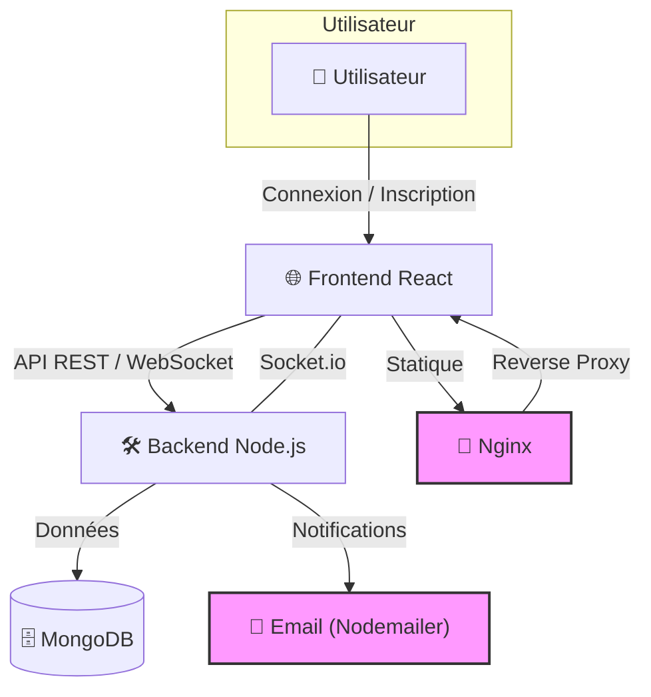
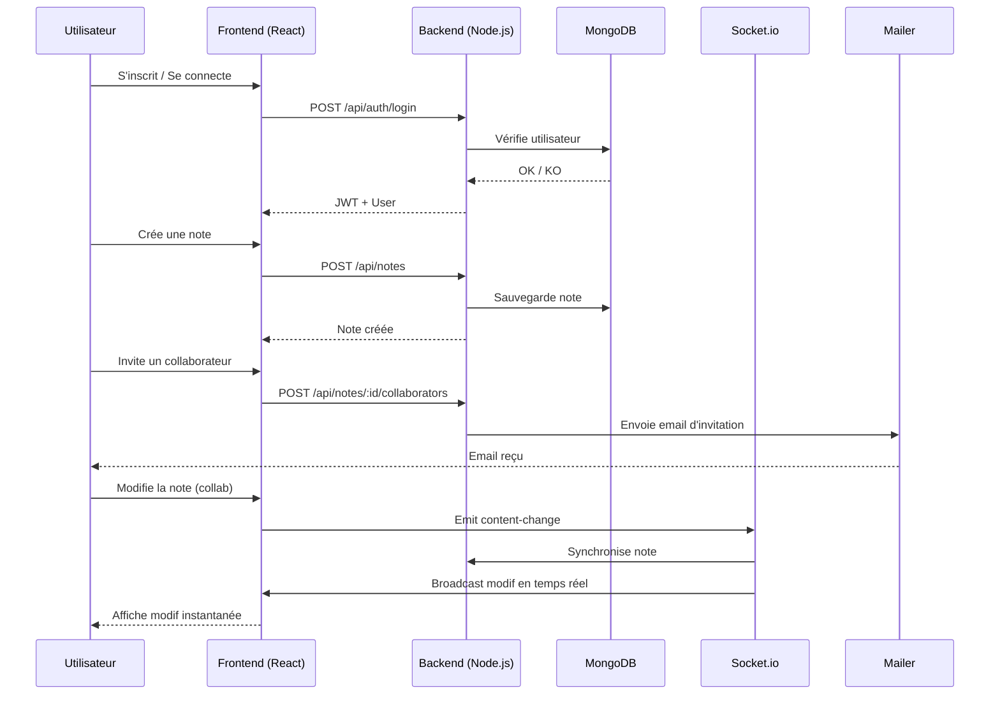
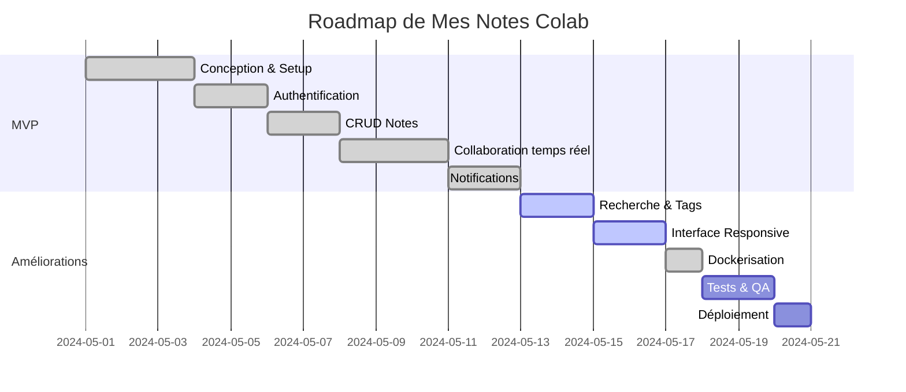

# 📝 Mes Notes Colab


<p align="center">
  
  
  
  
  
</p>

---

## 🚀 Fonctionnalités Clés

- 🔐 **Authentification sécurisée** (JWT, Bcrypt, gestion de sessions)
- 📝 **Gestion complète des notes** (création, édition, suppression, archivage)
- 👥 **Édition collaborative en temps réel** (Socket.io)
- 📤 **Partage de notes** (invitation email, permissions)
- 🏷️ **Tags, recherche avancée, filtres**
- 📧 **Notifications en temps réel**
- 🎨 **Interface moderne, responsive, animations fluides**
- 🛠️ **API RESTful documentée (Swagger)**
- 🐳 **Dockerisation complète (dev & prod)**
- 🧰 **Scripts de maintenance, backup, monitoring**

---

## 🖥️ Aperçu de l'Application

- **Dashboard** : Vue d'ensemble, statistiques, accès rapide aux notes
- **Éditeur collaboratif** : Markdown, présence en temps réel, gestion des conflits
- **Gestion du profil** : Modification des infos, mot de passe, avatar
- **Notifications toast** : Collaboration, erreurs, succès
- **Recherche & Filtres** : Par titre, contenu, tags, statut (archivé, partagé, public)

---

## 🏗️ Architecture Visuelle



---

## 🔄 Flux de Collaboration (Temps Réel)



---

## 🗺️ Roadmap du Projet



---

## 📦 Installation & Démarrage

### 🚀 Installation Ultra-Rapide (Docker)

```bash
# 1. Cloner et démarrer en une commande
 git clone https://github.com/votre-username/mesnotescolab.git
 cd mesnotescolab
 make install
```

- **Frontend** : http://localhost:3000
- **Backend API** : http://localhost:5000
- **Swagger** : http://localhost:5000/api-docs
- **Compte test** : `test@mesnotescolab.com` / `test123`

> 📚 Guide complet Docker : [DOCKER.md](DOCKER.md)

### 🛠️ Installation Manuelle (Développement)

```bash
# Backend
cd backend
npm install
cp .env.example .env # puis éditer .env
npm run dev

# Frontend
cd ../frontend
npm install
echo "REACT_APP_API_URL=http://localhost:5000" > .env
npm start
```

---

## 🐳 Commandes Docker Utiles

```bash
make up         # Lancer l'application (prod)
make down       # Arrêter
make logs       # Logs
make dev-up     # Mode développement (hot-reload)
make dev-logs   # Logs dev
make clean      # Nettoyer
make db-backup  # Sauvegarder la base
```

---

## 📚 Documentation API (Swagger)

Swagger UI : http://localhost:5000/api-docs

### Endpoints principaux

- `POST /api/auth/register` : Inscription
- `POST /api/auth/login` : Connexion
- `GET /api/auth/me` : Profil
- `PUT /api/auth/profile` : Modifier profil
- `GET /api/notes` : Lister notes
- `POST /api/notes` : Créer note
- `GET /api/notes/:id` : Détail note
- `PUT /api/notes/:id` : Modifier note
- `POST /api/notes/:id/collaborators` : Ajouter collaborateur

---

## 👥 Collaboration en Temps Réel

- **Édition simultanée** : Plusieurs utilisateurs sur la même note
- **Synchronisation instantanée** : Modifs visibles en direct
- **Gestion des conflits** : Versioning, notifications
- **Indicateur de présence** : Avatars des connectés
- **Permissions** : Lecture, écriture, admin
- **Partage par email** : Invitation automatique

---

## 🔒 Sécurité

- **JWT** : Authentification sécurisée
- **Bcrypt** : Hash des mots de passe
- **Validation** : Données côté serveur
- **Protection des routes** : Middleware d'auth
- **CORS** : Sécurisé pour le frontend

---

## 🎨 Interface Moderne

- **Material-UI** : Composants élégants
- **Framer Motion** : Animations fluides
- **Responsive** : Desktop & mobile
- **Thème personnalisé** : Gradients, couleurs

---

## 🧪 Tests & Qualité

- **Frontend** : `npm test` (unitaires)
- **Backend** : `npm run test` (si tests présents)
- **Lint** : `npm run lint`

---

## 🆘 Dépannage & FAQ

- **MongoDB ne démarre pas** : Vérifiez Docker ou service local
- **Port déjà utilisé** : Libérez le port (3000 ou 5000)
- **Problème d'email** : Vérifiez les variables EMAIL_USER/EMAIL_PASS
- **Erreur CORS** : Vérifiez l'URL du frontend dans .env
- **Logs** : Utilisez `make logs` ou consultez les terminaux

---

## 📸 Exemples d'Utilisation

- **Créer une note** :
  1. Cliquez sur "+"
  2. Rédigez en Markdown
  3. Invitez un collaborateur
  4. Modifiez à plusieurs en temps réel

- **Rechercher une note** :
  1. Utilisez la barre de recherche
  2. Filtrez par tags ou statut

- **Archiver/Supprimer** :
  1. Cliquez sur l'icône correspondante dans le dashboard

---

## 📋 Fonctionnalités à Tester (Checklist)

- [x] Authentification JWT
- [x] Création/édition/suppression de notes
- [x] Collaboration temps réel
- [x] Partage & permissions
- [x] Notifications
- [x] Recherche, tags, filtres
- [x] Interface responsive
- [x] Dockerisation complète

---

## 📄 Licence

MIT

---

<p align="center"><b>Mes Notes Colab</b> – Collaboration simplifiée pour vos notes 🚀</p>
