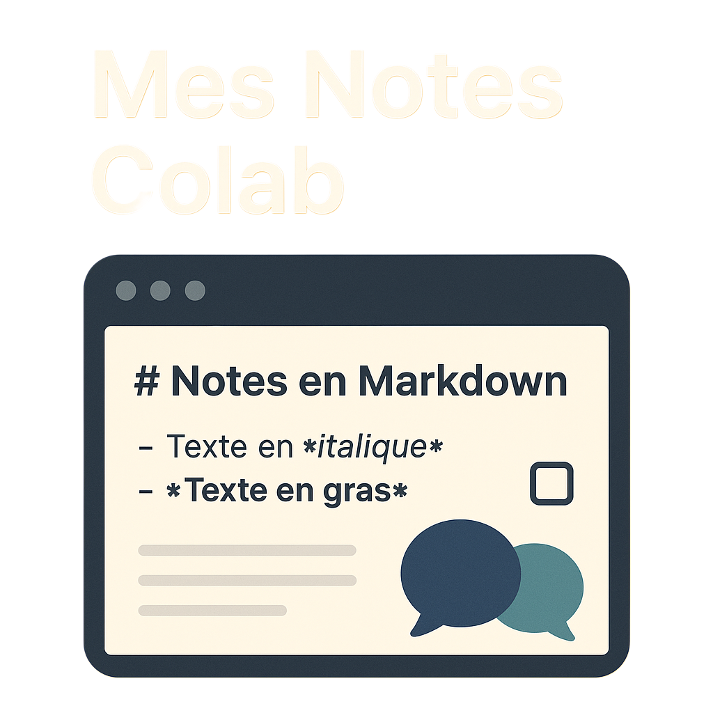
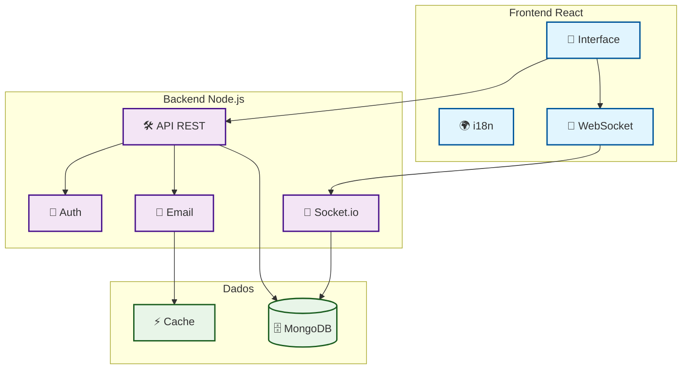
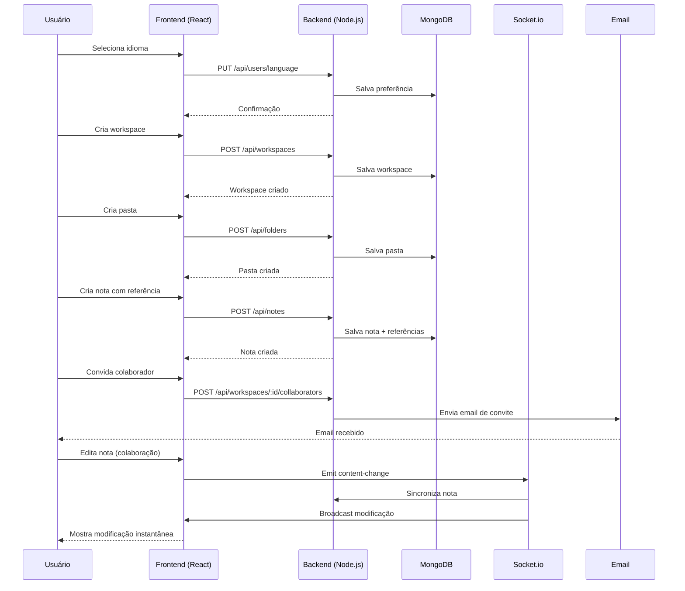
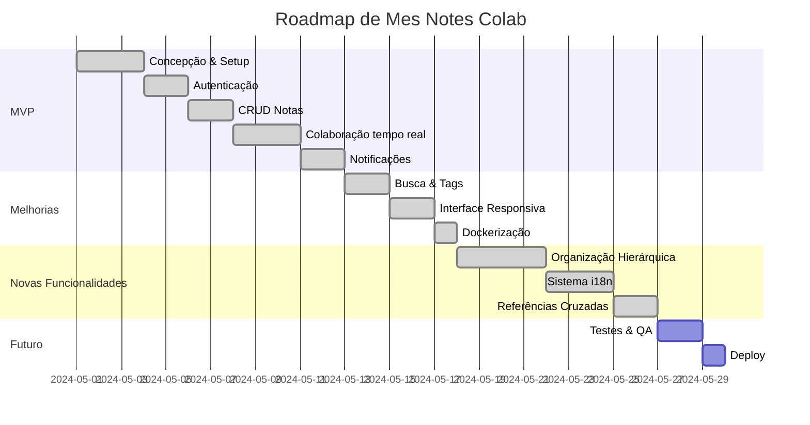

# 📝 Mes Notes Colab



<p align="center">
  
  
  
  
  
  
</p>

---

## 🚀 Funcionalidades Principais

### 🔐 **Autenticação e Segurança**
- **JWT** : Autenticação segura com tokens
- **Bcrypt** : Hash seguro de senhas
- **Validação** : Dados validados no servidor
- **Proteção de rotas** : Middleware de autenticação

### 📝 **Sistema de Notas Avançado**
- **CRUD completo** : Criar, editar, excluir, arquivar notas
- **Organização hierárquica** : Workspaces → Pastas → Notas
- **Notas aninhadas** : Notas podem conter outras notas (pai/filho)
- **Referências cruzadas** : `{{Nome_da_Nota}}` cria links clicáveis
- **Markdown** : Suporte completo a formatação
- **Tags e categorização** : Organização por tags

### 🏗️ **Organização Hierárquica**
- **Workspaces** : Espaços de trabalho principais
  - Sub-workspaces (hierarquia infinita)
  - Pastas organizacionais
  - Sistema de cores por workspace
- **Pastas** : Organização dentro de workspaces
  - Sub-pastas
  - Hierarquia visual
  - Permissões herdadas
- **Notas** : Conteúdo organizado
  - Pertencem a um workspace obrigatório
  - Podem estar em uma pasta opcional
  - Suporte a notas pai/filho

### 🌍 **Sistema de Internacionalização**
- **4 idiomas** : Português, Francês, Inglês, Alemão
- **Persistência por usuário** : Idioma salvo no backend
- **Detecção automática** : Idioma do navegador
- **Interface completa** : Seletor no header com bandeiras
- **Traduções organizadas** : Por seções (auth, dashboard, notes, etc.)

### 👥 **Colaboração em Tempo Real**
- **Edição simultânea** : Múltiplos usuários na mesma nota
- **Sincronização instantânea** : Modificações visíveis em tempo real
- **Indicador de presença** : Avatars dos usuários conectados
- **Gerenciamento de conflitos** : Versioning e notificações
- **Permissões granulares** : Leitura, escrita, administrador

### 📤 **Compartilhamento e Colaboração**
- **Convites por email** : Sistema automático de convites
- **Permissões por nível** : Workspace → Pasta → Nota
- **Colaboradores** : Gerenciamento de equipes
- **Notas públicas/privadas** : Controle de visibilidade

### 🔍 **Busca e Filtros Avançados**
- **Busca inteligente** : Por título, conteúdo, tags
- **Filtros múltiplos** : Por workspace, pasta, status
- **Referências cruzadas** : Busca por notas referenciadas
- **Hierarquia** : Navegação por estrutura

### 📧 **Sistema de Notificações**
- **Notificações em tempo real** : Toast notifications
- **Emails automáticos** : Convites, modificações
- **Templates personalizados** : HTML responsivo
- **Múltiplos tipos** : Compartilhamento, modificação, convite

### 🎨 **Interface Moderna**
- **Material-UI** : Componentes elegantes e responsivos
- **Framer Motion** : Animações fluidas
- **Tema personalizado** : Gradientes e cores consistentes
- **Design responsivo** : Desktop e mobile
- **Acessibilidade** : Suporte a leitores de tela

### 🛠️ **Infraestrutura**
- **API RESTful** : Documentada com Swagger
- **Socket.io** : Comunicação em tempo real
- **Docker** : Containerização completa
- **MongoDB** : Banco de dados NoSQL
- **Nginx** : Proxy reverso

---

## 🖥️ Visão Geral da Aplicação

### **Dashboard**
- Visão geral dos workspaces
- Estatísticas de notas e colaborações
- Busca e filtros avançados
- Acesso rápido às notas recentes

### **Editor Colaborativo**
- Suporte completo a Markdown
- Presença em tempo real
- Referências cruzadas clicáveis
- Gerenciamento de conflitos

### **Sistema de Workspaces**
- Criação e gerenciamento de workspaces
- Hierarquia de sub-workspaces
- Sistema de cores e organização
- Permissões por workspace

### **Gerenciamento de Pastas**
- Organização dentro de workspaces
- Sub-pastas e hierarquia
- Sistema de cores por pasta
- Filtros por pasta

### **Perfil do Usuário**
- Informações pessoais
- Preferências de idioma
- Configurações de segurança
- Histórico de atividades

---

## 🏗️ Arquitetura Visual



---

## 🔄 Fluxo de Colaboração em Tempo Real



---

## 🗺️ Roadmap do Projeto



---

## 📦 Instalação e Inicialização

### 🚀 Instalação Ultra-Rápida (Docker)

```bash
# 1. Clonar e iniciar em um comando
git clone https://github.com/seu-username/mesnotescolab.git
 cd mesnotescolab
 make install
```

- **Frontend** : http://localhost:3000
- **Backend API** : http://localhost:5000
- **Swagger** : http://localhost:5000/api-docs
- **Conta teste** : `test@mesnotescolab.com` / `test123`

> 📚 Guia completo Docker : [DOCKER.md](DOCKER.md)

### 🛠️ Instalação Manual (Desenvolvimento)

```bash
# Backend
cd backend
npm install
cp template.env .env # depois editar .env
npm run dev

# Frontend
cd ../frontend
npm install
echo "REACT_APP_API_URL=http://localhost:5000" > .env
npm start
```

---

## 🐳 Comandos Docker Úteis

```bash
make up         # Iniciar aplicação (produção)
make down       # Parar
make logs       # Logs
make dev-up     # Modo desenvolvimento (hot-reload)
make dev-logs   # Logs dev
make clean      # Limpar
make db-backup  # Fazer backup da base
```

---

## 📚 Documentação API (Swagger)

Swagger UI : http://localhost:5000/api-docs

### Endpoints principais

#### **Autenticação**
- `POST /api/auth/register` : Registro
- `POST /api/auth/login` : Login
- `GET /api/auth/me` : Perfil
- `PUT /api/auth/profile` : Modificar perfil
- `PUT /api/users/language` : Atualizar idioma

#### **Workspaces**
- `GET /api/workspaces` : Listar workspaces
- `POST /api/workspaces` : Criar workspace
- `GET /api/workspaces/:id` : Detalhes workspace
- `PUT /api/workspaces/:id` : Modificar workspace
- `DELETE /api/workspaces/:id` : Excluir workspace
- `POST /api/workspaces/:id/collaborators` : Adicionar colaborador

#### **Pastas**
- `GET /api/folders/workspace/:workspaceId` : Listar pastas
- `POST /api/folders` : Criar pasta
- `GET /api/folders/:id` : Detalhes pasta
- `PUT /api/folders/:id` : Modificar pasta
- `DELETE /api/folders/:id` : Excluir pasta
- `POST /api/folders/:id/collaborators` : Adicionar colaborador

#### **Notas**
- `GET /api/notes` : Listar notas
- `POST /api/notes` : Criar nota
- `GET /api/notes/:id` : Detalhes nota
- `PUT /api/notes/:id` : Modificar nota
- `DELETE /api/notes/:id` : Excluir nota
- `GET /api/notes/workspace/:workspaceId` : Notas por workspace
- `GET /api/notes/:id/children` : Notas filhas
- `GET /api/notes/:id/references` : Referências cruzadas
- `GET /api/notes/search` : Buscar por título
- `POST /api/notes/:id/collaborators` : Adicionar colaborador

---

## 🌍 Sistema de Internacionalização

### **Idiomas Suportados**
- 🇵🇹 **Português** (padrão)
- 🇫🇷 **Francês**
- 🇺🇸 **Inglês**
- 🇩🇪 **Alemão**

### **Funcionalidades**
- **Detecção automática** : Idioma do navegador
- **Persistência** : Salvo no backend por usuário
- **Fallback** : Português como idioma padrão
- **Interface** : Seletor no header com bandeiras
- **Traduções completas** : Todas as strings da interface

### **Uso**
1. Clique no ícone de idioma no header
2. Selecione o idioma desejado
3. A interface muda instantaneamente
4. A preferência é salva automaticamente

---

## 🏗️ Organização Hierárquica

### **Workspaces**
- **Espaços de trabalho** : Organização principal
- **Sub-workspaces** : Hierarquia infinita
- **Sistema de cores** : Identificação visual
- **Permissões** : Controle de acesso por workspace

### **Pastas**
- **Organização** : Dentro de workspaces
- **Sub-pastas** : Hierarquia de organização
- **Cores** : Identificação por pasta
- **Herança** : Permissões do workspace pai

### **Notas**
- **Conteúdo** : Markdown com referências
- **Hierarquia** : Notas pai/filho
- **Referências** : `{{Nome_da_Nota}}` cria links
- **Colaboração** : Edição em tempo real

---

## 👥 Colaboração em Tempo Real

### **Funcionalidades**
- **Edição simultânea** : Múltiplos usuários na mesma nota
- **Sincronização instantânea** : Modificações visíveis em tempo real
- **Indicador de presença** : Avatars dos usuários conectados
- **Gerenciamento de conflitos** : Versioning e notificações
- **Permissões granulares** : Leitura, escrita, administrador

### **Compartilhamento**
- **Convites por email** : Sistema automático
- **Permissões por nível** : Workspace → Pasta → Nota
- **Colaboradores** : Gerenciamento de equipes
- **Notas públicas/privadas** : Controle de visibilidade

---

## 🔒 Segurança

### **Autenticação**
- **JWT** : Tokens seguros
- **Bcrypt** : Hash de senhas
- **Validação** : Dados validados no servidor
- **Proteção de rotas** : Middleware de autenticação

### **Autorização**
- **Permissões granulares** : Por workspace, pasta, nota
- **Herança de permissões** : Do workspace para pastas e notas
- **Controle de acesso** : Baseado em roles
- **Auditoria** : Log de atividades

---

## 🎨 Interface Moderna

### **Design System**
- **Material-UI** : Componentes elegantes
- **Framer Motion** : Animações fluidas
- **Tema personalizado** : Gradientes e cores
- **Responsivo** : Desktop e mobile
- **Acessibilidade** : Suporte a leitores de tela

### **Funcionalidades UI**
- **Seletor de idioma** : Com bandeiras no header
- **Organização visual** : Hierarquia clara
- **Referências cruzadas** : Badges clicáveis
- **Notificações toast** : Feedback em tempo real

---

## 🧪 Testes e Qualidade

### **Frontend**
```bash
npm test          # Testes unitários
npm run lint      # Linting
npm run build     # Build de produção
```

### **Backend**
```bash
npm test          # Testes unitários
npm run lint      # Linting
npm run dev       # Desenvolvimento
```

---

## 🆘 Solução de Problemas e FAQ

### **Problemas Comuns**
- **MongoDB não inicia** : Verifique Docker ou serviço local
- **Porta já em uso** : Libere a porta (3000 ou 5000)
- **Problema de email** : Verifique EMAIL_USER/EMAIL_PASS
- **Erro CORS** : Verifique URL do frontend no .env
- **Logs** : Use `make logs` ou consulte os terminais

### **FAQ**
- **Como mudar o idioma?** : Clique no ícone de idioma no header
- **Como criar um workspace?** : Use o botão "+" no dashboard
- **Como referenciar uma nota?** : Use `{{Nome_da_Nota}}` no texto
- **Como convidar colaboradores?** : Use o menu da nota/workspace

---

## 📸 Exemplos de Uso

### **Criar uma Nota com Referências**
1. Crie um workspace
2. Crie uma pasta dentro do workspace
3. Crie uma nota na pasta
4. Escreva `{{Nome_da_Outra_Nota}}` para criar referência
5. A referência aparece como badge clicável

### **Organização Hierárquica**
1. **Workspace** : "Projeto A"
   - **Sub-workspace** : "Desenvolvimento"
     - **Pasta** : "Frontend"
       - **Nota** : "Componentes React"
       - **Nota** : "Estados e Props"
     - **Pasta** : "Backend"
       - **Nota** : "API Routes"
       - **Nota** : "Database Schema"

### **Colaboração**
1. Crie uma nota
2. Convide colaboradores por email
3. Editem simultaneamente
4. Vejam modificações em tempo real

---

## 📋 Funcionalidades para Testar (Checklist)

### **Autenticação e Perfil**
- [x] Registro e login
- [x] Gerenciamento de perfil
- [x] Mudança de idioma
- [x] Logout

### **Organização**
- [x] Criação de workspaces
- [x] Sub-workspaces
- [x] Criação de pastas
- [x] Hierarquia de organização

### **Notas**
- [x] Criação e edição
- [x] Referências cruzadas
- [x] Notas aninhadas
- [x] Markdown completo

### **Colaboração**
- [x] Edição em tempo real
- [x] Convites por email
- [x] Permissões granulares
- [x] Indicador de presença

### **Busca e Filtros**
- [x] Busca por texto
- [x] Filtros por workspace
- [x] Filtros por pasta
- [x] Busca de referências

### **Interface**
- [x] Responsivo
- [x] Animações fluidas
- [x] Seletor de idioma
- [x] Notificações toast

---

## 📄 Licença

MIT

---

<p align="center"><b>Mes Notes Colab</b> – Colaboração simplificada para suas notas 🚀</p>
